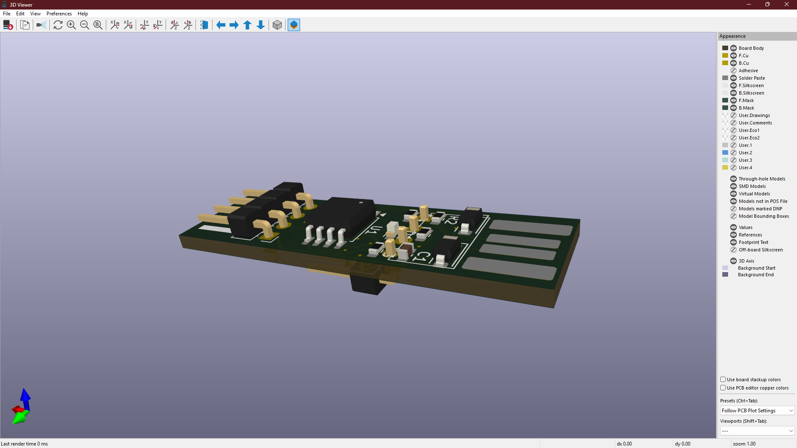
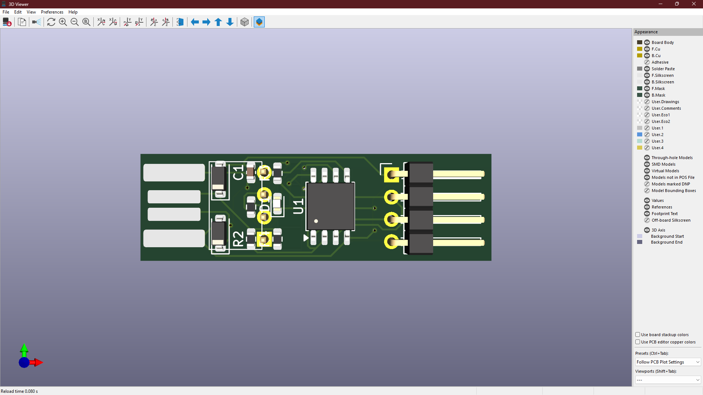
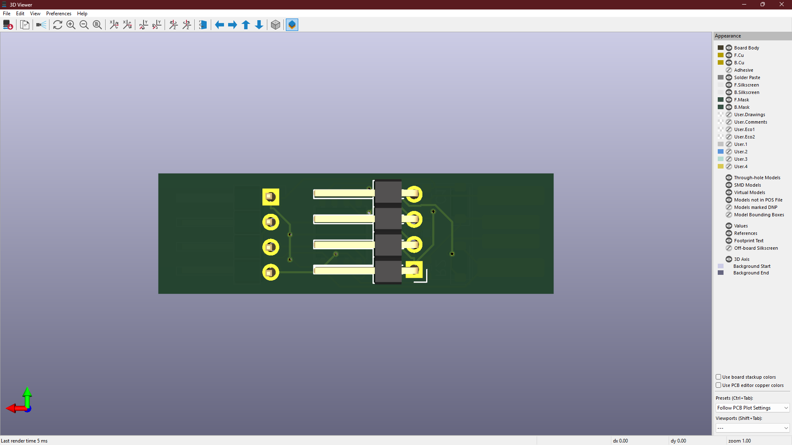

# 🔌 KiCad Hardware Design Project

## 🔍 Overview
This repository contains an **open-source hardware design project created using KiCad**, including complete **schematic diagrams**, **PCB layout**, and **manufacturing-ready outputs**.  
It is intended for **learning, reference, and practical PCB prototyping**.

---

## 🛠️ Tools Used
🧰 KiCad (Version 7 or later)
🖼️ PCB Editor
🔷 3D Viewer
---

## 🖼️ PCB Preview
### 🔷 3D View

### 🔷 Top Layer

### 🔷 Bottom Layer

---

## 🗂️ Repository Structure
HARDWARE/ → KiCad schematic and PCB design files
IMAGES/ → Schematic, PCB layout, and 3D render images
BOM/ → Bill of Materials
GERBER/ → Manufacturing-ready Gerber files
---

## 🚀 How to Open the Project
1. Install **KiCad (v7 or later)**  
2. Clone this repository  
3. Open `USB_pro` using KiCad  

---

## 📦 Project Outputs
- ✅ Complete schematic design  
- ✅ PCB layout (top & bottom layers)  
- ✅ 3D PCB visualization  
- ✅ Bill of Materials (BOM)  
- ✅ Gerber files for PCB fabrication  

---

## 📄 License
📜 This project is licensed under the  
MIT LICENSE

---

## 👤 Author
**Naraender**  

---

## ⭐ Notes
If you find this repository useful, consider **starring ⭐ it** and using it as a reference for your own KiCad projects.
